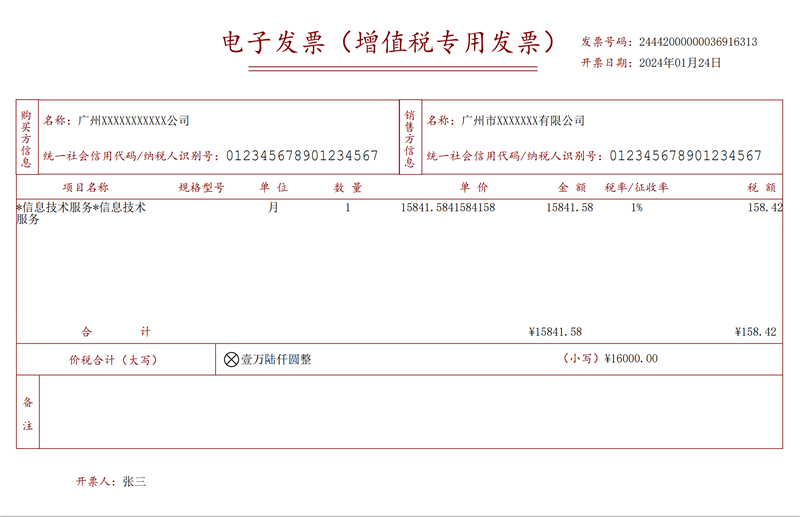

# 全电发票 XML 转 PDF

## 引用
- [iTextSharp.LGPLv2.Core](https://github.com/VahidN/iTextSharp.LGPLv2.Core)

## 参考资料
- [财政部会计司关于公布电子凭证会计数据标准（试行版）的通知](https://kjs.mof.gov.cn/zt/kuaijixinxihuajianshe/dzpzkjsjbzshsd/sjbz/202305/t20230517_3885004.htm)